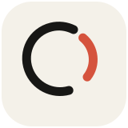

<div align="center">



# capri

**Keep the important people and unfinished things in your conversations.**

Share a conversation screenshot. See what capri understood. Choose what is
worth keeping. Pick it up before the next conversation.

[Explore the product](https://gettalentsignal.com) ·
[Try the synthetic demo](https://gettalentsignal.com/demo) ·
[Download and setup](docs/operations/macos-distribution.md) ·
[Run locally](#quick-start)

[](https://github.com/getyak/talent-signal/actions/workflows/ci.yml)
[](https://github.com/getyak/talent-signal/actions/workflows/security.yml)

</div>

## A conversation worth keeping

You meet Chen Xia at an event. Later, he writes: “I can look at your product
next week.” You promise to send an introduction, but there is no meeting date.

The useful result is simple: remember how you met, keep the promise in view,
and recover the right background when you talk again. A later reply should
help update that same work instead of producing another disconnected note.

capri is the personal Agent serving you. People are the relationship records
that provide context. The product direction is to understand why a conversation
matters, preserve the parts you choose, and help you continue with less effort.
Client work, partnerships, collaboration, and recruiting share this foundation;
recruiting is one specific context.

## The experience we are building

```text
share a screenshot
→ see useful, sourced understanding
→ resolve ambiguity and choose what to keep
→ preserve background or unfinished work
→ return later or update it with a new conversation
```

A new acquaintance without a task is useful. An undated promise stays undated.
Waiting, pausing reminders, and stopping are valid outcomes. A polished summary
does not mean anything has been saved or sent.

The intended Person page answers three questions: how do we know each other,
what changed recently, and what is still unfinished? These are product targets;
they do not imply every supported client already implements the full journey.

Read the canonical [Product](docs/product.md) and
[Capture to action](docs/capture-to-action.md) contracts.

## What exists today

This repository contains an evolving product and its governed engineering
foundation. Capability, access, and release readiness are separate: code, a
synthetic demo, or a configured provider is not proof of a complete live journey.

| Area | Repository capability | Boundary |
| --- | --- | --- |
| Public website and demo | Product narrative and interactive, deterministic evidence review | Demonstrations use synthetic people and conversations; they do not connect to private WeChat accounts. |
| Authenticated Web workspace | People, Sessions, source review, governed work, and account settings | Requires an authorized configured backend. A successful demo does not establish production data readiness. |
| Screenshot processing | Purpose-bound image intake, proposed understanding, identity review, and source-linked drafts | Private model processing requires configured services and disclosed scope. Intake is not fact confirmation or permission to send a message. |
| Native clients and capture | iOS capture/review and macOS workspace/distribution paths | Availability, signing, network access, and verification vary by release; use the current setup guides. |
| Shared backend | Evidence, identity, time-scoped state, approvals, receipts, retention, deletion, and recovery | Real external writes require a specifically implemented capability and exact human approval; a simulated effect is not a live integration. |
| Personal Agent continuity | Governed context, work proposals, and bounded research primitives | The complete screenshot-to-return experience remains evidence-gated. Reminders and open-ended autonomy are not implied. |

[Delivery](docs/delivery.md) owns the release sequence and remaining proof.
[Evaluations](https://github.com/getyak/capir-evals/tree/main/evidence/) contain dated evidence, including local and
synthetic results. Do not read those results as field-value or production claims.

## Trust is product behavior

| Layer | What it means |
| --- | --- |
| Person | Reviewed identity; a name alone cannot bind private context. |
| Memory | Attributed background with source, time, purpose, and changing authority. |
| Unfinished work | A commitment or shared goal with an owner and a continuation condition; no invented deadline. |
| Human decision | Fact confirmation, internal filing, and external-effect approval stay separate. |
| Result | Prepared, saved, sent, failed, and unknown have different observable outcomes. |
| Control | Inspect, correct, pause, stop, and delete, including derived material. |

capri starts from intentional sharing, preserves uncertainty, and ranks work
attention rather than people. Screenshots are purpose-bound private evidence.
A generated answer cannot authorize its own effect. See
[Principles](docs/principles.md), [Agent system](docs/agent-system.md), and
[Integrations](docs/integrations.md).

## Quick start

Use Node.js 22.19.0 or newer and pnpm 11.18.0.

```bash
pnpm install --frozen-lockfile
pnpm dev
```

Open [http://localhost:3000](http://localhost:3000).

- `/` presents the product and its synthetic examples.
- `/demo` provides deterministic evidence review.
- `/login` uses configured authentication.
- `/workspace` requires an authorized account and configured workspace access.

See the [Web guide](apps/web/README.md) and
[account access guide](docs/operations/account-access.md) for configuration and
isolated test workspaces. Public demo text and authenticated screenshot intake
have different persistence boundaries; inspect the chosen surface's disclosure.

For native setup, use the [iOS guide](apps/ios/README.md) and
[macOS download guide](docs/operations/macos-distribution.md).
[Releases](https://github.com/getyak/talent-signal/releases) describe available
artifacts and signing status. Existing package, repository, and application
identifiers remain compatibility contracts during the display-brand transition.

## Contributing and verification

Start with the [knowledge map](docs/README.md), [AGENTS.md](AGENTS.md), and
[REVIEW.md](REVIEW.md). Preserve unrelated changes and deliver a complete,
observable user outcome, including relevant ambiguity, retry, and deletion paths.

```bash
pnpm docs:check
pnpm lint
pnpm typecheck
pnpm test
pnpm build
```

Use the narrowest checks for the change. `pnpm check` runs the broader repository
suite; native testing uses the [local iOS test procedure](docs/operations/ios-local-testing.md)
when native boundaries are affected. Documentation changes require `pnpm docs:check`.

## Repository map

| Path | Owns |
| --- | --- |
| [apps/web](apps/web/) | Public website, demo, authenticated Web experience |
| [apps/ios](apps/ios/) | Native mobile capture, review, and continuity |
| [apps/macos-hybrid](apps/macos-hybrid/) | Native desktop workspace and capture shell |
| [apps/backend](apps/backend/) | Governed shared state, workers, and recovery |
| [packages](packages/) | Contracts, Agent primitives, and shared implementation |
| [brand](brand/README.md) | Brand assets and their usage |
| [docs](docs/README.md) | Canonical product decisions, operations, and evidence |
| [.agents/skills](.agents/skills/) | Reusable design, safety, review, and knowledge methods |
| [evals (private corpus)](https://github.com/getyak/capir-evals/tree/main/evals/) | Synthetic behavior and safety cases |
| [_index](_index/README.md) | Raw sources and editable compiled-Wiki inputs |

Canonical documentation is English. Historical research, release evidence, and
stable identifiers keep their original context; they are not current product
promises. The [documentation system](docs/documentation.md) defines ownership,
authority, and safe pruning.
