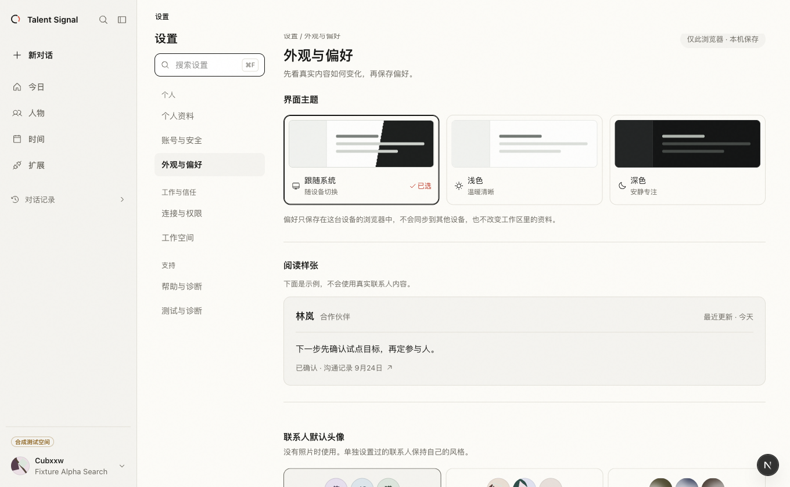
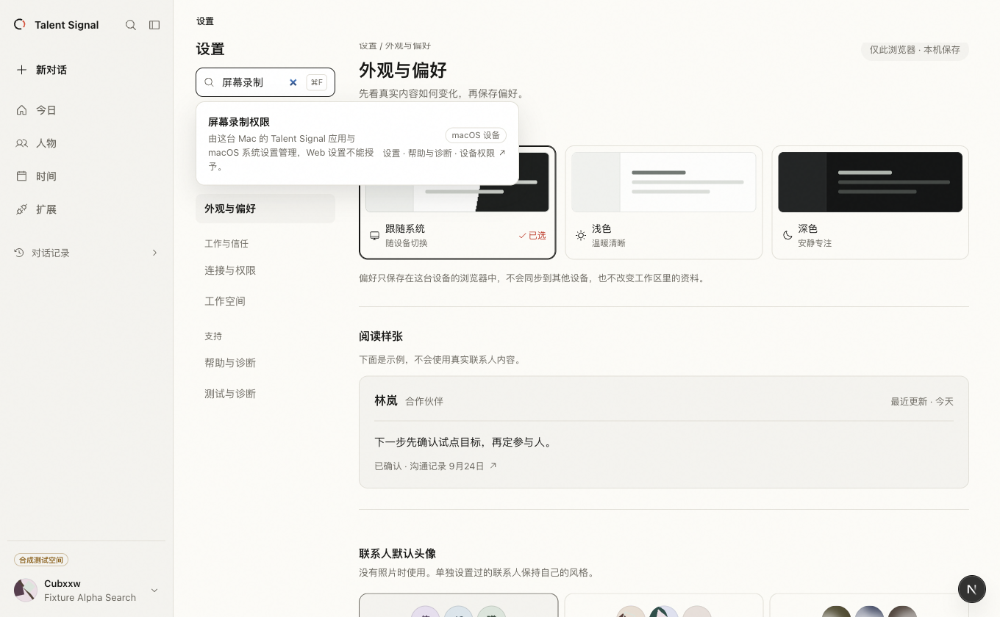

# GET-51 settings implementation review

## Outcome and scope

The authenticated Web workspace now has one settings navigation, search, honest scope and permission explanations, and staged appearance preferences. The macOS host keeps one native Settings window; device controls and updates remain native, while Web-owned settings use a single embedded pane. Ordinary workspace links and the account profile editor hand off to the main window.

This review used the documented synthetic local account and a disposable database. No real candidate or customer record was used. The [Figma direction](https://www.figma.com/design/7Z8yHplvwjVhpq8IuKv87f?node-id=47-4593) informed the layout; these screenshots show the running Web implementation, not the Figma frames.

## Running Web evidence

| Surface | Evidence | Readback |
| --- | --- | --- |
| Desktop appearance |  | One settings rail within the authenticated workspace; three theme choices and a synthetic content sample. |
| Desktop search |  | “屏幕录制” resolves to the Mac device permission explanation with its scope and exact destination. |
| Narrow connections |  | Settings navigation becomes a compact grid and content uses the available width. |

The browser also confirmed: an unsaved dark preview leaves local storage untouched; Cancel restores the prior theme; Save persists after reload; leaving Appearance with an unsaved preview restores the saved theme. Search returns a no-results message, and Escape clears the query while retaining input focus. Authenticated links to ordinary workspace destinations cause document navigation for the macOS navigation delegate to handle. The profile editor uses the same document-navigation contract for its `/onboarding?edit=true` route; a focused test guards against replacing that anchor with a client-side link.

## Native evidence and limits

An isolated, differently identified Debug build was launched against the same disposable local fixture. In the actual macOS accessibility tree and window screenshot:

- `⌘,` opened `Talent Signal Settings` with one native sidebar. After fixture login, the Web pane showed only the selected settings content: no nested settings navigation, workspace rail, or workbench header.
- Choosing `此设备` displayed native local controls, including content size and connection diagnostics. This page was usable before fixture login.
- Native search for `屏幕录制` returned `屏幕录制权限` with a device scope and macOS System Settings destination.
- Clicking the `手动导入的资料` link from the connected Settings pane brought the existing main window forward. Pressing `⌘,` again returned to the same Settings window and retained `连接与权限` selection.

The main window in this isolated run used `--ui-testing` synthetic preview mode, so that observation confirms window activation but not final rendering at `/workspace/captures`. The route policy unit tests assert the destination URL. The isolated app was quit after inspection; the user's running production app was untouched.

The macOS app builds, its UI tests compile, and the full native unit suite passed after the final route guard. The route tests cover same-origin handoff, untrusted navigation cancellation, client-side URL recovery, offline device selection, and single-window section mapping. The host's XCTest UI runner exits before test bootstrap even for existing UI tests, so that runner cannot establish an automated live-window result.

## Verification

- Web: focused settings and link-handoff tests passed. The final full suite passed: 191 files passed, 1 skipped; 1,426 tests passed, 1 skipped. Typecheck and production build passed. Lint had 0 errors and 5 warnings in untouched files. The first full-suite attempt exposed a reused one-shot `Response` in a pre-existing Memory review test fixture; making the mock create a response per request removed the unhandled rejection, and the final suite passed.
- macOS: build and build-for-testing succeeded; `TalentSignalMacTests` executed 170 tests with 5 skips and 0 failures; focused settings tests passed 23/23.
- Repository: `git diff --check` and `pnpm docs:check` passed. The production build reported a nonfatal Google Fonts network fetch failure during prerender; it completed successfully with the fallback font.

## Known limit

WebKit's handling of client-side history changes has policy-level and compiled UI-test coverage, but the recovery case was not provoked in a live app. Do not count the XCTest UI runner as passed.
