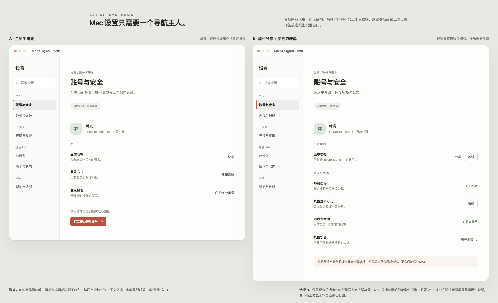

# Settings direction review

The [editable comparison](directions.html) uses synthetic account content. The user's screenshots show the problem to remove: a native Settings rail around a full older Web workspace, followed by another account settings navigation. A local source view or a merged PR cannot stand in for the resident Web revision actually shown in the installed client.

| Criterion | A: native summary and handoff | B: native navigation, bounded account form |
| --- | --- | --- |
| Five-second location clarity | Strong: one rail, one summary. | Strong when the Web content has no workspace chrome or inner tabs. |
| Account editing | Adds a second "manage account" step in the main workspace. | Keeps the existing backend-owned edit, save, retry and session readback in place. |
| Authority and recovery | Avoids a duplicate writer, but makes Settings mostly a directory. | Uses one existing writer; a signed-out or incompatible Web release gets a native handoff, never a fake form. |
| Accessibility and density | Few controls, but an extra context switch for each edit. | One focus path through the selected pane; secondary recovery sits behind a named disclosure. |

**Direction B is selected.** macOS owns the Settings window, category rail, local device controls and compatibility gate. The authenticated Web account pane owns its existing mutations. The gate must prove the specific settings content contract and hidden workspace chrome before showing the WebView. An old resident release, sign-in screen or standalone auth flow must show a native explanation and a direct main-window route instead of appearing as a complete Web product inside Settings.

The version surface is a quiet list, not a health dashboard: each component reports a version only from its actual runtime or local manifest, with source and observation time. A release version is never presented as another device's installed version. Update status is verified, available, unknown or failed, and each unknown state names the next check.

The original screenshot is not a valid aesthetic baseline for the merged GET-51 source because the installed macOS build and resident Web were on different revisions. Final review needs uncropped light/dark, narrow, login-expired, old-Web and populated-account captures from the real host.

## Version evidence at intake

| Component | Observed identity | What the observation proves |
| --- | --- | --- |
| Installed macOS app | `0.1.0 (29)` in the app's native Update pane | Installed Mac build; its signed update check was current at that check time. |
| Resident Web | `26a664bb` from the active release receipt | The connected service was still older than merged GET-51 Web source `a12d51bc`; this explains the full Web shell in the user's screenshot. |
| Backend | Not verified from the host during this review | No backend revision is inferred from a healthy Web page or from the repo checkout. |
| iOS | Public release tag `v0.1.88` was visible, installed device unknown | A release tag is not the build installed on a particular iPhone. |
| Browser extension | Source manifest `0.2.0`, installed browser unknown | The packaged source version does not prove what another browser installed. |

These are component-specific identifiers; the digits and Git revisions are not directly comparable across platforms. The new version surface makes that provenance visible instead of assigning one synthetic shared version.

## Running synthetic surfaces

The current authenticated Web build was opened against a disposable PostgreSQL fixture and documented synthetic account. [Account & security](account-web.png) has one settings navigation, shows the login method needing attention, and places optional unconnected providers plus explanatory sync copy behind keyboard-operable disclosures. [Versions & status](versions-web.png) fits all five component rows in a 1360 × 1150 viewport; its [dark state](versions-web-dark.png) retains the same hierarchy, and the 390 px viewport reflows without horizontal overflow. Its development Web revision and an unset backend revision are explicitly unknown; a successful backend request is not reported as a verified version. Web theme marker readback showed the workspace navigation, inner settings navigation and outer sidebar all had zero layout rectangles while the settings content remained visible.

An isolated unsigned Mac build connected to a loopback-only *older* synthetic Web page with no settings-surface marker. Clicking the workbench's settings link opened the native Settings scene and selected the intended section. The right side displayed the native "Web version unsupported" recovery state; no old workspace header, sidebar or bottom navigation was painted. Code and native tests keep Help and Mac Update as separate offline-capable panes. The native UI pipe closed during a later Help click, so that specific live pane and an authenticated current-Web Mac capture are not counted as verified; policy/WebKit tests and build coverage are recorded separately.

## Outcome review

| Question from `REVIEW.md` | Evidence and limit |
| --- | --- |
| One calm route from the avatar menu? | A synthetic main-WebView client transition opened the one native Settings scene. The old-Web case showed native recovery instead of full Web chrome. The installed production client remains unchanged until a signed update is installed. |
| No duplicate account authority? | The Web account panel still uses the existing authenticated writer, human confirmation and authoritative readback. Its embedded form has no second settings tabs. Optional providers and other sessions are disclosed but remain reachable and keyboard operable. |
| Versions traceable and honest? | Web uses a validated active build receipt or deployment SHA; backend uses a sanitized optional runtime revision. Mac/iOS/extension use their own local build identity. A healthy backend request with no revision says the version is unknown; neither an iOS release tag nor an extension source manifest is called another device's installed version. |
| Recovery and failure visible? | Missing Web surface proof, login, a standalone auth flow and an unconfirmed probe use native explanations or explicit handoff. A failed or stale version observation is not labeled up to date. |

Focused Web, backend, extension, macOS and iOS builds/tests are recorded in the plan. The Mac UI automation runner remains unavailable on this host; the loopback old-Web click is the direct native evidence, while the current-Web Mac rendering and auth-subpage handoff remain policy/build plus browser-CSS evidence. The resident Web release was not switched because the Mac mini's Infisical keyring did not supply `/web` credentials over SSH.
