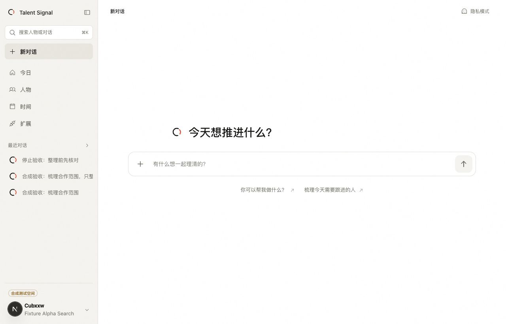
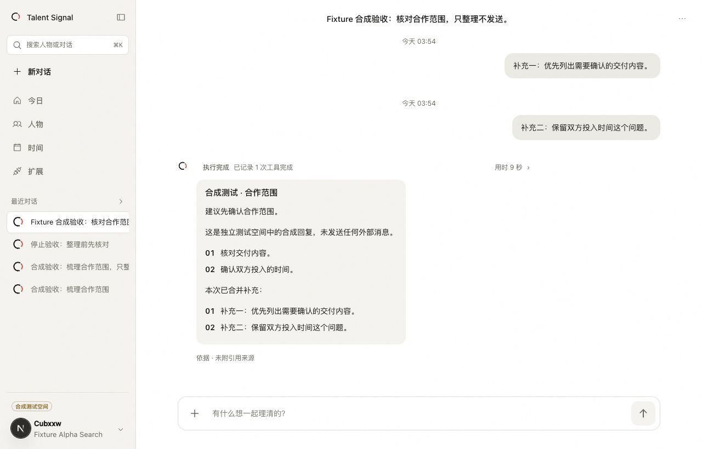
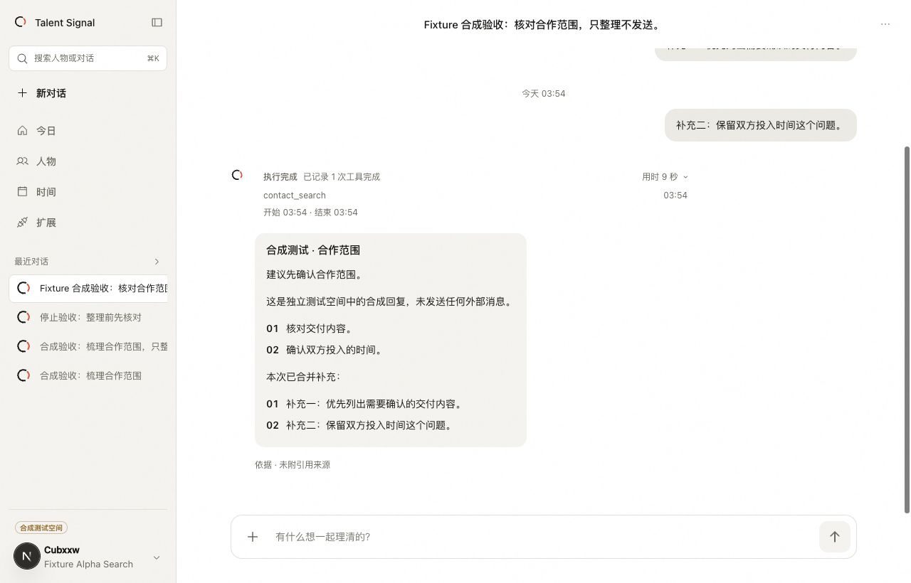
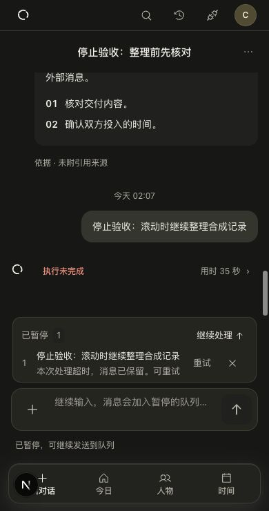

# GET-128 / GET-129 — delivery evaluation

Date: 2026-10-01
Plan: [`GET-128 / GET-129 plan`](../../../plans/2026-09-30-get-128-129-macos-conversation.md)

GET-129 compact navigation and person-preview follow-up measurements and
acceptance live in the [2026-10-02 evaluation](../2026-10-02-get-129/README.md).
This dated report retains the prior conversation-runtime evidence.

## Design and authority

The authenticated Web surface supplies the resident macOS workspace. Figma
7Z8yHplvwjVhpq8IuKv87f / 31:135 supplies the composition: 248px sidebar,
64px rail, single-line rows, 68px title and 880px transcript/composer axis.
The composer starts at 62px and grows for multiline input. Leading Agent
replies and trailing human messages use warm semantic bubbles and timestamps.
See [`design-measurements.md`](design-measurements.md) for the measured comparison.

Canonical history supplies final answers. Whole forming Markdown stays in
folded draft detail; lists, tables and code are never split into milestones.
The same execution record survives queued, running, review, failed, interrupted
and completed states. Tool receipts contain actual name/time only, bounded to
sixteen recorded completions. Elapsed time uses actual server run bounds.
Historical decision references remain unknown until governed review readback.
Silence is a valid successful reply; it does not fabricate an answer bubble.

## Current-task input and provenance

The primary SDK PostToolBatch admits supplemental context after the current
parallel tool batch. Stop provides the final checkpoint; eager prompt iteration
cannot close intake. A later primary checkpoint or successful final receipt
acknowledges consumption. The host coalesces rapid fragments (750ms quiet,
3s maximum wait) while retaining each original ID, accepted time and text.
Image supplements remain whole next-task work with an explicit reason because
hook context is text-only; overflow beyond twenty messages is also explicit.

Only acknowledged input enters the single combined canonical turn. Stop keeps
completed work and detaches unacknowledged input intact. Failure retains the
whole group for one explicit retry. All checkpoints are fenced by owned live
lease, Session and cancellation. Tool grounding uses individual messages;
Memory and calendar drafts retain one original source and their existing human
decision boundary. Public Session saves cannot reserve queued IDs, spoof an
execution receipt, rewrite a queue-owned answer, or change folded provenance.
Owned forks inherit exact provenance; legacy omission restores server fields.

## Local proof

- Agent: 332 passed, one existing skip. Web: 1,616 passed, one existing skip.
- Agent/backend/Web typechecks pass. Web lint has zero errors; existing warnings
  are unchanged. Documentation and architecture checks pass (90 migrations).
- Isolated PostgreSQL: 188 passed across queue, Session, workspace grounding,
  source checkpoints, default contact review and meeting-draft tests. Includes
  selection-window admission, unsupported-provider detachment, Stop races,
  source revocation, canonical answer tampering, legacy saves and owned forks.
- Further regression: all 86 Memory integration tests pass; backend without
  optional database fixtures passes 825 tests (393 fixture skips). Review fixes
  pass all 56 queue integration tests, including three stale force-close fences,
  exact old-format recovery/rejection and preserved Stop-race tool receipts.
- Production harness tests use the pinned SDK hook shape and the actual MCP tool
  invocation pipeline. They verify eager input, parallel tool boundaries,
  primary-run scoping, acknowledgment timing and cumulative budget failures.
- Browser: rapid B/C messages during A produce three original human messages,
  one final reply and one folded execution record; reload preserves all three
  identities, genuine tool metadata and run time. Empty home, collapsed rail,
  dark/390px/low-height, reduced motion, failed run, Escape/Continue, New and
  reader scroll behavior were exercised on synthetic fixtures.
- OS-level IME composition is not established by the browser driver; the existing
  composition-event keyboard tests remain the deterministic coverage.

Only disposable synthetic accounts and a no-network provider supply local
screenshots. No customer content, raw Figma trees, credentials or execution logs
are published. Failed provisional runs are not counted as passing evidence.

## Delivery gate

Independent review of the final source, current-head CI/security, PR merge and
resident Web/backend activation still require completion before either issue
can be marked Done. Local browser fixtures do not establish production provider
availability or a deployed macOS version.
