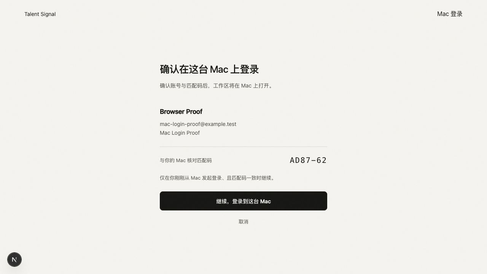
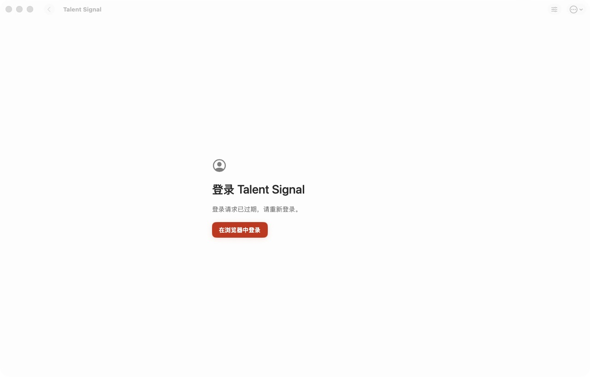
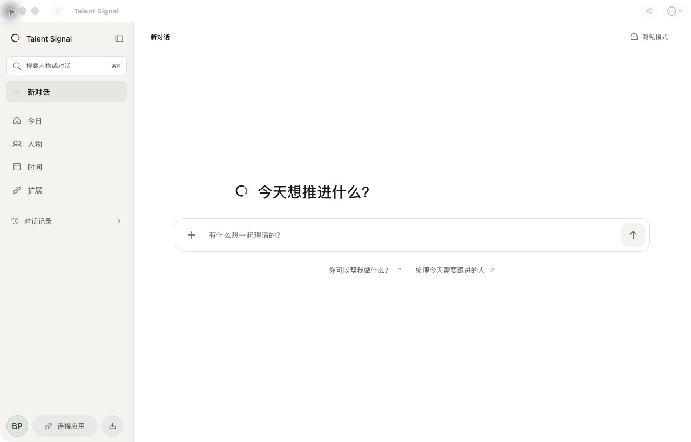
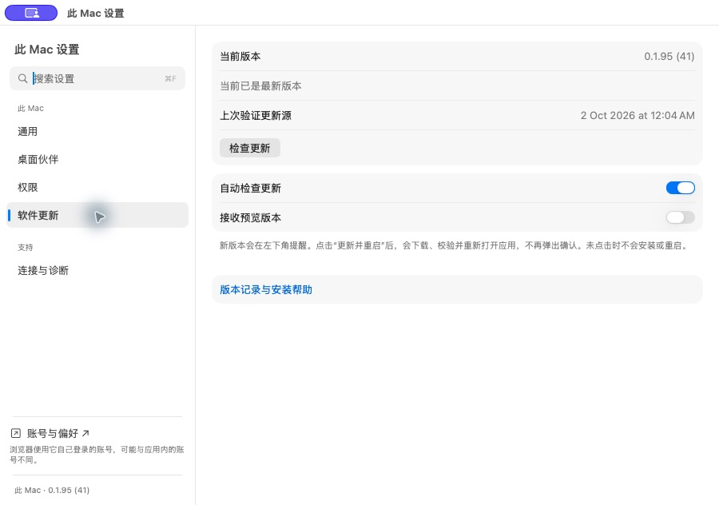

# Browser-owned Mac login acceptance, October 1, 2026

Decision: [ADR 0022](../../decisions/0022-browser-owned-macos-login.md). Active delivery state: [execution plan](../../../plans/2026-10-01-macos-browser-login.md). The screenshot contains only an owned disposable account. No customer evidence or provider credentials were collected.

| Evidence | Result | Scope |
| --- | --- | --- |
| Backend module, automatic request-log redaction and real PostgreSQL tests | 32 passed | Real constraints, exactly one concurrent device session, revocation winning its write-lock race, expired code after lock waiting refusing all session writes; unit failure matrix |
| Web server-page, protocol and proxy tests | 52 passed | Primary-session CSRF binding, exact origin/state, ordinary Credentials exchange, no-cookie-write live status and revoked/incomplete-cookie reauthentication |
| Native Debug application build | Passed | Production native constructors, generated Xcode source membership, no iOS Simulator |
| Native XCTest regression suite | 260 executed, 9 explicitly skipped, zero failures | 251 passing state/store, settings, Capture, workspace and other native unit tests; opt-in live fixtures excluded |
| Opted-in real persistent WKWebView test | Passed, 5.343 seconds | Actual anonymous prepare, synthetic authenticated backend approval, supported Auth.js cookie installation, awaited navigation, correlated live status, reopened selected store and stale-store refusal |
| Actual first-party browser confirmation and cancel | Observed | Live backend-owned disposable identity, request hint, intentional cancellation |
| Actual revoked-browser-session recovery | Observed | Retained browser cookie with backend session revoked; exact Mac request redirected to normal browser reauthentication, then returned to the same confirmation request and identity |
| Independent sub-agent review | No unresolved P0/P1 | URL-proof logging, stale lock-wait expiry and revoked-cookie recovery findings repaired and independently rechecked |
| CodeQL follow-up regressions | Backend 26 passed, Web 17 passed | Unbiased hint generation, quoted request-identifier escaping and closing-script input protection; independent re-review passed with no remaining P0/P1/P2; new-head scanning tracked in the plan |
| Native default-browser delivery regression | 58 passed, zero failures/skips | Actual Debug application build; opener/delegate, exact callback lease, duplicate/stale/cold-start rejection, fixed workspace presenter and store ownership |
| Authorization form-origin regressions | 54 Web tests passed; typecheck passed | strict-origin page policy, exact Origin/CSRF checks retained; null and foreign Origins refused |
| Full native → Safari → OS callback → workspace and restart | Passed with owned disposable identity | Actual native action opened Safari; matching code and account confirmed; Mac window closed before approval; Safari Allow delivered the OS callback; grant consumed before further native inspection; selected WK workspace showed exact identity; quit/relaunch restored it without browser login. Distinct ad-hoc proof app installed in a normal app location; signed installed release remains a separate gate |
| Signed/notarized release and installed client | Passed: 0.1.95 (41) | Exact merged source d8320ce1; published ZIP hash verified; Developer ID signature, staple, Gatekeeper, both CPU architectures and existing Sparkle key verified; application updater installed/restarted; installed executable matches the published archive; existing live workspace restored without credential entry |
| Fresh live Google/Apple provider authentication | Not repeated | Existing Web methods remain authoritative. The installed real account session stayed healthy; it was preserved instead of forcing logout to repeat provider authentication |
| Local backend and resident Web deployment | Backend `9f5c27e8`; Web `1b82a562` passed | Clean detached source, VM-readable Opik mounts, migrations, readiness, synthetic Opik checks and tailnet HTTPS probes; paired image/revision and current-release pointers read back. Resident-origin anonymous grant prepare/cancel succeeds; foreign origin is refused. This is not authenticated workspace admission |

The user authorized disk recovery. Online Colima trimming and verified idle,
reinstallable caches raised free space from approximately 60 GiB to 81 GiB
before deployment. Subsequent builds consumed part of that space; further idle
cache recovery restored approximately 80.2 GiB before native repair verification.
Repositories, application data, pending update packages, rollback images,
volumes, formal receipts and unrelated test artifacts were preserved. The
storage audit still warns about unrelated historical artifacts; those warnings
do not authorize cross-task deletion. Private cleanup/deployment receipts are
retained in the task state directory.

The WebKit test calls the production transport and exchanger. Its direct backend approval is a controlled fixture, not evidence of browser intention or OS callback delivery. The backend PostgreSQL clock-wait regression uses real PostgreSQL locks with a deterministic clock advanced after observing the lock barrier. Helpers alone cannot establish the full user chain; the separate OS receipt records the actual Safari approval and AppDelegate consumption. Source hashes identify the verified implementation snapshot; later changes require relevant revalidation.

The repaired production build serves exactly one `strict-origin` authorization-page header. Actual Safari POST metadata has the exact loopback Origin and an origin-only Referer, with no path/query proof. Null/foreign Origin admission remains forbidden. LaunchServices does not select a temporary-directory proof bundle as the URL handler merely because it is registered; the distinct test application was installed outside the temporary directory before the fresh successful operation. No old approved callback was replayed.

The proof app, all owned Safari auth tabs, fixture servers and disposable database/volume were removed after evidence preservation. The original Safari Start Page and authorized Safari HTTP/HTTPS defaults remain. At the October 1 fixture checkpoint the existing signed application had not yet been updated. The subsequent October 2 release/installation receipt below supersedes that pending release state.

## Signed release and installed-client acceptance, October 2

PR #268 was merged at `d8320ce1504cc43740088dff65f24d672639e38f`. Exact-main CI, Security and native checks passed. [Signed release v0.1.95](https://github.com/getyak/talent-signal/releases/tag/v0.1.95), native build 41, was published through the existing scoped workflow; both the app and DMG notarization were accepted, stapled and validated. The stable update feed was cryptographically verified and freshly read back by the publisher.

The parent downloaded the ZIP and matched its published SHA-256 manifest, then independently checked signature, staple, Gatekeeper, Universal architectures, callback registration and the unchanged updater trust anchor. A truncated initial download was not installed; official-origin continuation completed and passed the full archive hash. The user-authorized in-app Update and Restart installed build 41. Settings showed the exact version and current feed status; the installed executable matched the verified archive. The real existing workspace restored without another credential entry. No real account identifiers or conversation material are included in this receipt or screenshot.

Safari remains the HTTP/HTTPS default; `com.talentsignal.macos.auth` now resolves to the actual installed `com.talentsignal.macos` application. The old signed build is retained privately as an operator rollback package. Fresh public-provider authentication was not repeated, and the earlier owned full-callback fixture remains separately scoped; existing-session restoration is the signed installed-app user-surface proof.

